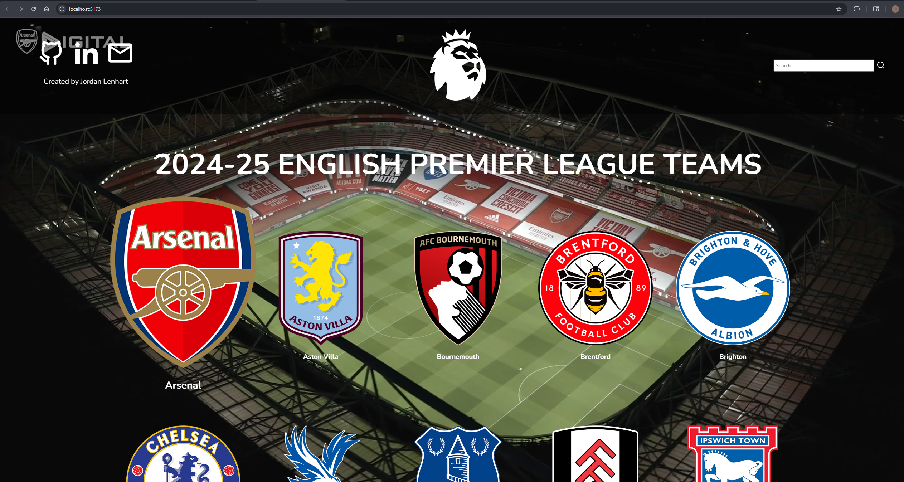

# ⚽ Premier League Teams Viewer

A sleek web app that fetches and displays all 20 English Premier League teams using TheSportsDB API. Click on any team to view detailed information in a custom modal — including stadium, year formed, social media links, and more. Built with vanilla JavaScript, HTML, and CSS.

 

---

## 🔧 How to Run Locally (With Vite)

1. **Clone the repository**

```bash
git clone https://github.com/jordanlenhart/epl-teams-viewer.git
cd epl-teams-viewer
```

2. **Install dependencies**

```bash
npm install
```

3. **Start the development server**

```bash
npm run dev
```

4. **Open in your browser**
After running the dev server, Vite will output a local URL such as:

```arduino
http://localhost:5173/
```

Open that link in your browser to view the app!

## 🚀 Features

- ✅ Fetches real-time EPL team data from [TheSportsDB API](https://www.thesportsdb.com/api.php)
- ✅ Displays team logos and names in a responsive grid
- ✅ Click a team to view:
  - Stadium name
  - Year formed
  - Full team description
  - Fanart background in modal
  - Social media links (Website, Twitter, Instagram, YouTube)
- ✅ Live search filter with dynamic result updating
- ✅ "Clear" button appears when search input has text

---

## 🛠️ Technologies Used

- **HTML5**
- **CSS3**
- **Vite**
- **Vanilla JavaScript (ES6+)**
- **[TheSportsDB API](https://www.thesportsdb.com/api.php)**